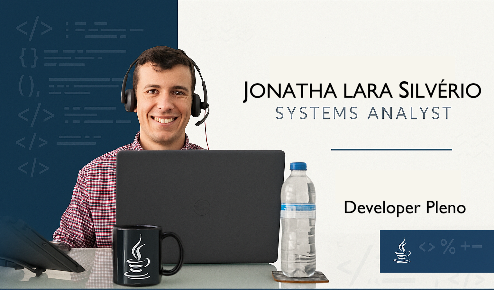

# dio-bradesco-java
Repositório de conteúdo do curso DIO Bradesco 2025

# Atalhos windowns

| **Atalho**                | **Função**                                                                 |
|---------------------------|---------------------------------------------------------------------------|
| `crtl + shit + win + alt`   | Abre Microsoft 365.                                                     |
|`ctrl + win + shift + B`    | Reinicia os drives da placa de vídeo.                                   |
| `win + R  / mrt`            | Verificar vírus windowns defender.                                      |
| `win + R / NETPLWIZ`        | Procurar usuários suspeitos (caso, remover).                            |
| `win + shift + S`           | Print área especifica do pc.                                            |
| `win + alt + R`             | Gravar tela.                                                            |
| `win + G`                   | Vizualizar gravações de tela salvas.                                    |
| `win + H`                   | Gravar voz.                                                             |
| `win + R`                   | Ativar o assistente do Eclipse para sugestões rápidas.                  |
| `win + C`                   | Abrir copilot IA Microsoft.        .                                    |
| `win + R /cmd ou powershel` | Abrir prompt de comando.                                                |
| `win+R/cmd src/scannernow`  | Corrigir programas e inconsistências.                                   |

# Atalhos Eclipse

| **Atalho**                | **Função**                                                                 |
|---------------------------|---------------------------------------------------------------------------|
| `Ctrl + Shift + O`        | Organizar importações automaticamente.                                   |
| `Ctrl + D`                | Excluir a linha atual.                                                   |
| `Ctrl + Espaço`           | Sugestão de preenchimento automático.                                    |
| `Alt + Shift + R`         | Renomear variáveis, métodos ou classes.                                  |
| `Ctrl + Shift + F`        | Formatar o código.                                                       |
| `Ctrl + H`                | Pesquisar em todo o projeto.                                             |
| `Ctrl + F11`              | Executar o aplicativo.                                                  |
| `Ctrl + Shift + T`        | Abrir uma janela de busca para tipos Java.                               |
| `Ctrl + 1`                | Ativar o assistente do Eclipse para sugestões rápidas.                   |
| `Alt + Shift + A`         | Ativar seleção em bloco.                                                |

 ----------------------------
# Atalhos Visual Studio Code

| **Atalho**                | **Função**                                                                 |
|---------------------------|---------------------------------------------------------------------------|
| `Ctrl + Shift + P`        | Abre a paleta de comandos para acessar funcionalidades rapidamente.       |
| `Ctrl + P`                | Localiza e abre arquivos no projeto.                                      |
| `Ctrl + Shift + N`        | Abre uma nova janela do VS Code.                                          |
| `Ctrl + Shift + T`        | Reabre a última aba fechada.                                              |
| `Ctrl + /`                | Comenta ou descomenta a linha ou seleção atual.                           |
| `Ctrl + Shift + F`        | Pesquisa global em todos os arquivos do projeto.                         |
| `Alt + ↑ / Alt + ↓`       | Move a linha ou seleção atual para cima ou para baixo.                   |
| `Ctrl + B`                | Mostra ou oculta a barra lateral.                                         |
| `Ctrl + K, Ctrl + S`      | Abre a janela de atalhos de teclado para personalização.                 |
| `Ctrl + Shift + '`        | Alterna o terminal integrado.                                            |

# Atalhos IntelliJ IDEA

| **Atalho**                | **Função**                                                                 |
|---------------------------|---------------------------------------------------------------------------|
| `Ctrl + Shift + N`        | Abrir um arquivo rapidamente pelo nome.                                  |
| `Ctrl + N`                | Pesquisar classes pelo nome.                                             |
| `Ctrl + Shift + F`        | Buscar em todo o projeto.                                                |
| `Ctrl + Alt + L`          | Reformatar o código.                                                     |
| `Ctrl + D`                | Duplicar linha ou seleção.                                               |
| `Alt + Insert`            | Gerar código automaticamente (getters, setters, construtores, etc.).     |
| `Shift + F6`              | Renomear variáveis, classes ou métodos.                                  |
| `Alt + F7`                | Mostrar onde um elemento do código está sendo usado.                    |
| `Ctrl + /`                | Comentar ou descomentar código.                                          |
| `Shift + Shift`           | Pesquisar qualquer coisa dentro da IDE.                                 |

# Downloads

| **Artefato**                | **Endereço**                                                                 |
|---------------------------|---------------------------------------------------------------------------|
| `Vs Code`                 | https://code.visualstudio.com/docs/languages/java                                |
| `Eclipse`                 | https://www.eclipse.org/downloads/packages/release/kepler/sr1/clipse-ide-java-developers                                             |
| `Intelij IDEA`            | https://www.jetbrains.com/pt-br/idea/download/?section=windows                                               |
| `jdk java`                | https://www.oracle.com/br/java/technologies/downloads/                                                   |

 ## 🤓Quem sou eu?
 Oi meu nome é Jonatha, resido em Londrina - PR, sou analista desenvolvedor de sistemas Java. Tenho graduação como Tecnólogo em Análse e Desenvolvimento de Sistemas na Unicesumar e atualmente faço uma pós graduação na Universidade Federal do Paraná em Metodologia Ágil de Software. Fiz transição de carreira na pandemia e trabalho com o mesmo cliente desde então.

🏹`Skills`

Java, Java Script, Html, CSS, React, Angular, PHP, Node.js, tomcat, Apache e Nginx, Shell, Bancos de dados Relacionais SQL, DB2, COBOL, API RestFull, midewares, UX Design, Pensamento Learn, Mapas Mentais, Testes Automatizados, Prototipação Figma, AWS, Azure, Kubbernetz, Docker, Integração Contínua, Entrega Contínua, trabalho em equipe, scrum, jira, git, gitHub, gitlab, gid (IBM), Arquitetura de sistemas, Engenharia de Software. 

